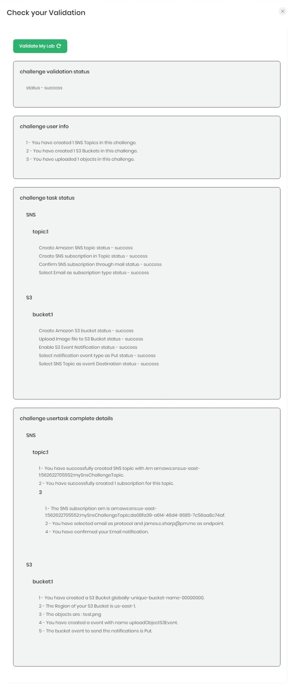

<h1 align="center">
Whizlabs Challenge League
</h1>

<h2 align="center">
Challenge Lab Four
</h2>

<h2 align="center">
Static Website Hosting using S3
</h2>

---

WhizLabs is running a cloud challenge between May and July 2022.  The challenge is to complete various tasks in either AWS, GCP, or Azure to test cloud skills.  Following is my solution to challenge lab four.

---
<h3>From Whizlabs</h3>

[Cloud Challenge Details](inst.jpeg)

>In this lab challenge, your Amazon S3 skill is put to the test. You'll be given a requirement and you have to reach it using your knowledge of Amazon S3 and other AWS services. The Lab Challenge helps you understand the real-time scenarios.
    A company XYZ needs to host a web application as a part of their infrastructure. Now your challenge is to create a static HTML website using Amazon S3 and make it accessible from the internet.<br><br>
>Follow the below instructions to complete this challenge. 
>1.	Create a Bucket and uncheck Block all Public access.
>2.	[Click here](https://labtask10045.s3.amazonaws.com/s3-website-challenge.zip) to download the zip file and unzip it to find two html files, index.html and error.html files.
>3.	Add the below policy as the bucket policy and replace S3_BUCKET_ARN with your buckets ARN.
```
{ 
   "Id":"Policy1",
   "Version":"2012-10-17",
   "Statement":[ 
      { 
         "Sid":"Stmt1",
         "Action":[ 
            "s3:GetObject"
         ],
         "Effect":"Allow",
         "Resource":"S3_BUCKET_ARN/*",
         "Principal":"*"
      }
   ]
}
```
>4.	Upload the index.html and error.html files to your S3 bucket.
>5.	Enable Static Website hosting:
>     1. Choose index.html as Index Document
>     2. Choose error.html as Error Document
>6.	Test the website by accessing the S3 Endpoint in your browser.
>7.	Test the error page by adding some random characters at the end of the URL.
---
<br><br>
Download the zip file and extract index.html and error.html

Login into AWS and search/choose *S3*.

<p align="center">
  
</p>

Click *Create bucket*.

<p align="center">
  
</p>

Enter a globally unique bucket name.

Uncheck *Block all public access*.

Check the box to acknowledge the bucket being public

Click *Create bucket*.

<p align="center">
  
</p>

Open notepad or any other text editor.

Copy and paste the bucket policy into it.

Back in AWS, select the bucket and click *Copy ARN*.

Replace *S3_BUCKET_ARN* with the actual ARN in the text editor.

Click on your bucket.

<p align="center">
  
</p>

Click *Upload*.

<p align="center">
  
</p>

Click *Add files*.

<p align="center">
  
</p>
Select both index.html and error.html and click open.

Both files will appear in **Files and Folders**.

Check *Upload*.

<p align="center">
  
</p>

Navigate to the bucket and click *Permissions*.

<p align="center">
  
</p>

Under **Bucket policy**, click *Edit*.

<p align="center">
  
</p>

Delete the current policy.

<p align="center">
  
</p>

From the text editor, copy and paste the policy then click *Save chnages*.

<p align="center">
  
</p>

Click *Properties*.

<p align="center">
  
</p>

Under **Static website hosting** click *Edit*.

<p align="center">
  
</p>

Select *Enable* and *Host a static website*.

For **Index document**, type *index.html*.

For **error document**, type *error.html*.

Click *Save changes*.

<p align="center">
  
</p>

<h1>Lab is complete</h1>

<p align="center">
  
</p>

<h1>Video Example</h1>

[](https://youtu.be/1KOqOgfG8HQ)
